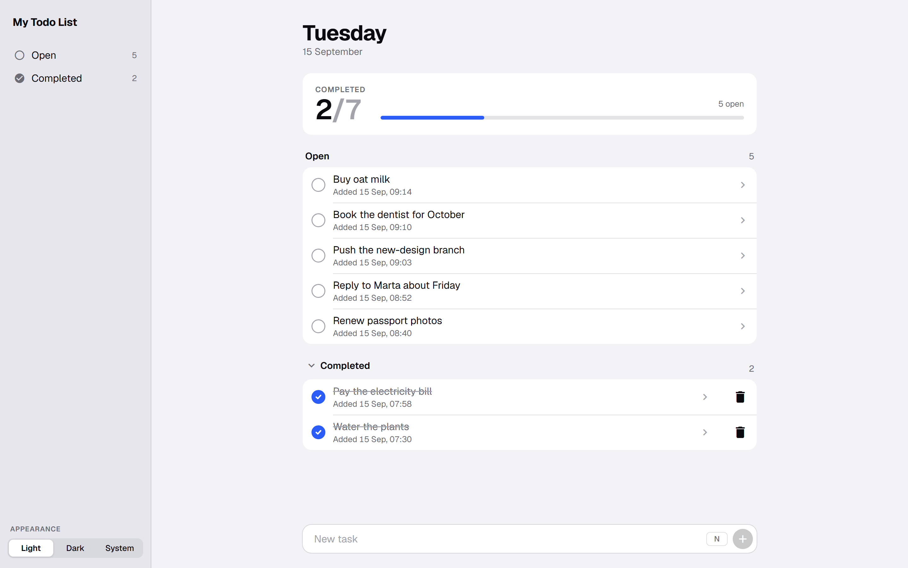
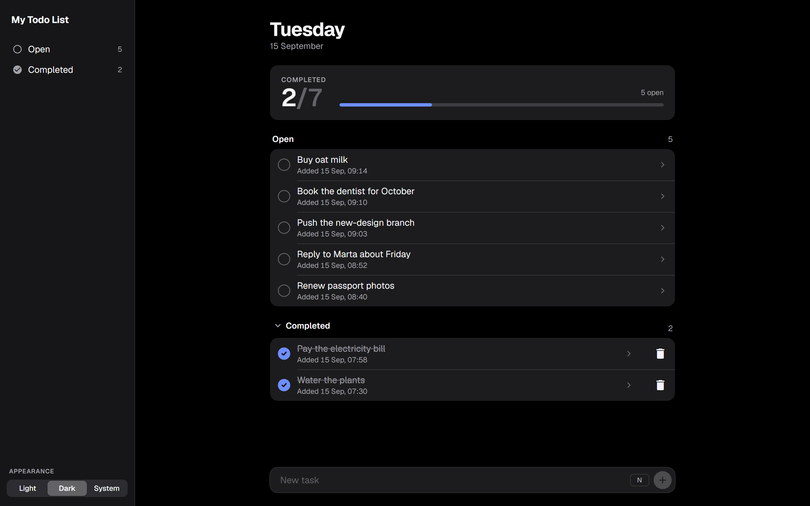
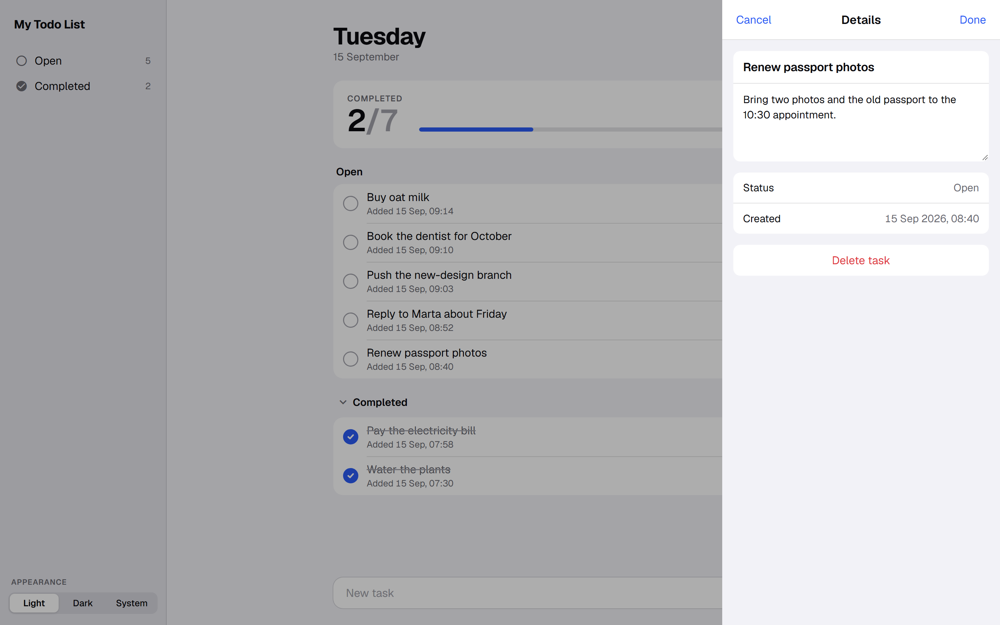
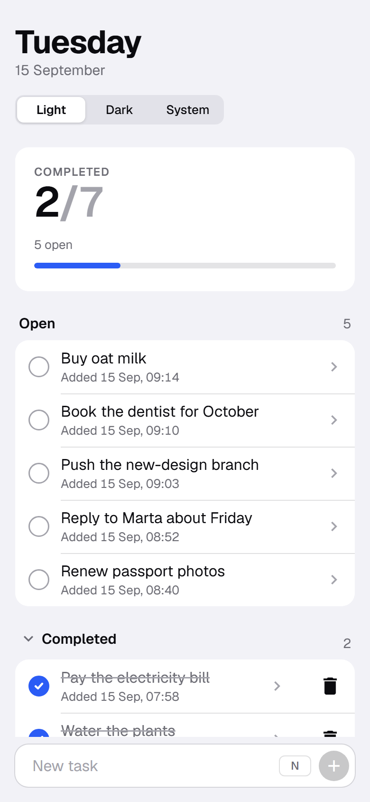
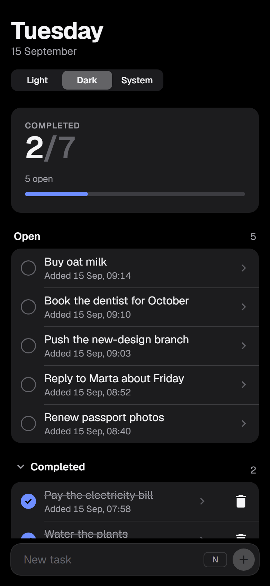
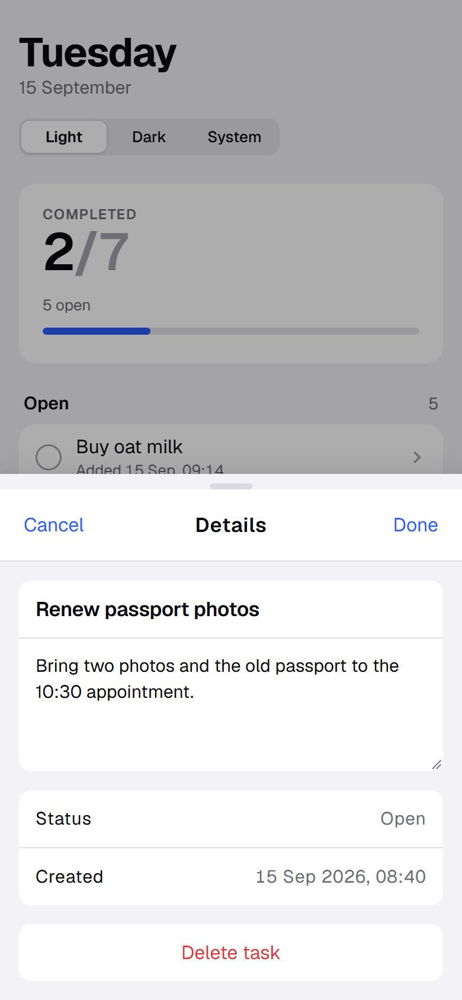
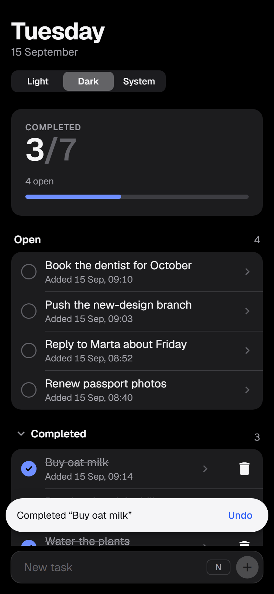

# My Todo List

A to-do app for the browser, rebuilt around a design system of its own: Apple's layered surfaces, Trade Republic's black-and-white restraint, and Revolut's big, readable numbers.

Angular 19 · Standalone components · Signals · Angular Material 3 · SCSS design tokens · 77 unit tests



## What makes it interesting

**A design system, not a coat of paint.** Every colour, spacing step, radius and easing curve is a token declared once in [`src/styles/_tokens.scss`](src/styles/_tokens.scss) with the CSS `light-dark()` function. Switching theme means changing a single `color-scheme` property, and every surface, label and accent follows.

**Angular Material is themed, not fought.** Material reads those same tokens through `mat.theme()` and per-component overrides, so the app contains zero `!important` rules and no copies of Material's internal class names.

**Light, Dark and System.** The appearance follows the operating system by default and can be pinned either way. The choice survives a reload.

**One layout, two shapes.** A sidebar from 900px wide; below that, a single column with an iOS-style large title. Task details open as a side panel on a desktop and as a bottom sheet on a phone.

**Interactions that forgive mistakes.** Completing a task waits nine tenths of a second, so a second tap calls it off, and both completing and deleting offer Undo.

**Built to be usable by everyone.** Real buttons with `checkbox`, `radiogroup`, `progressbar` and `list` roles, visible focus rings, full keyboard operation, and animations that stop when the system asks for reduced motion.

## Screenshots

| Light | Dark |
| --- | --- |
|  |  |

Task details open beside the list on a desktop, so the list stays visible:



On a phone the same screens become a single column, and the details arrive as a bottom sheet:

<p>
  
  
  
  
</p>

The tasks in these screenshots are examples, not real data.

## The redesign

The first version worked, but it was three greys stacked on top of each other, with the same drop shadow on every surface.

<details>
<summary>The original version</summary>


</details>

The rebuild was done step by step, and each step is its own commit:

| Before | After |
| --- | --- |
| 24 colour variables, 12 of them unused, some renamed per theme | ~40 role-named tokens, each defined once for both themes |
| 9 `!important` rules overriding Material's internals | 0, replaced by `mat.theme()` and token overrides |
| 5 font families loaded, 2 actually used | 1 family: the system font, with Geist as a fallback |
| Fixed 15% / 85% split at every screen size | Sidebar at 900px and up, single column below |
| A theme toggle that picked the wrong mode when you clicked the icon | Light / Dark / System, with the system as the default |
| No undo, and a details dialog that never saved | Undo on completing and deleting, and details that save |
| 716 kB initial bundle | 588 kB |

## Design tokens

| Token | Light | Dark | Used for |
| --- | --- | --- | --- |
| `--bg` | `#f2f2f7` | `#000000` | The ground behind the grouped lists |
| `--surface` | `#ffffff` | `#1c1c1e` | Rows, cards, the composer, sheets |
| `--label` / `--label-2` | `#0b0b0f` / `#6c6c74` | `#f5f5f7` / `#a1a1a8` | Task names, then dates and counts |
| `--accent` | `#2b5cf5` | `#6e8eff` | Only ever state: checked, selected, focused |
| `--ink` | `#0b0b0f` | `#f5f5f7` | The main action on a screen, and toasts |
| `--success` / `--danger` | `#1f9d55` / `#e0383e` | `#3dd37a` / `#ff6961` | All done, and destructive actions |

Type is the system font, so SF Pro on a Mac or an iPhone, with [Geist](https://fonts.google.com/specimen/Geist) as the fallback everywhere else. Numbers use tabular figures so they don't jitter as they change.

## Keyboard

| Key | What it does |
| --- | --- |
| <kbd>N</kbd> | Jump to the composer from anywhere |
| <kbd>Enter</kbd> | Add the task |
| <kbd>Esc</kbd> | Leave the composer, or close the details |
| <kbd>Tab</kbd> | Move through rows; every control has a visible focus ring |
| <kbd>←</kbd> <kbd>→</kbd> | Move between Light, Dark and System |

## How it is put together

```
src/
├── app/
│   ├── animations/     Row enter and leave animation
│   ├── components/
│   │   ├── todo-home/              Layout, sidebar, sections, undo toasts
│   │   ├── todo-list/              Grouped list
│   │   ├── todo-item/              Task row with its circular check
│   │   ├── todo-summary/           Progress card
│   │   ├── todo-task-item-dialog/  Task details, as a panel or a sheet
│   │   ├── todo-footer-input/      Composer wrapper
│   │   └── utils/                  Composer, appearance control
│   ├── constants/      Storage keys, date formats, timings, dialog configs
│   ├── models/         Task, appearance and details types
│   └── services/       Appearance, and opening the task details
└── styles/
    └── _tokens.scss    The design tokens
```

Two rules keep this tidy: types live in `models/` and constants in `constants/`, so components only ever reference them; and no component hard-codes a colour, a spacing value or a duration.

Tasks are kept in `localStorage`, so there is no backend to run.

## Running it

```bash
git clone https://github.com/Isaacgc1999/todo_list_app.git
cd todo_list_app
npm install
npm start
```

Then open http://localhost:4200.

```bash
npm test          # 77 unit tests in Karma and Jasmine
npm run build     # production build
```

## What could come next

- Due dates and reminders. The warning colour is already reserved in the tokens.
- Several lists, with the sidebar becoming real navigation.
- A backend, so tasks follow you between devices.

## Licence

Released under [CC0 1.0 Universal](LICENSE): public domain, do what you like with it.

## Contact

Isaac García — [@Isaacgc1999](https://github.com/Isaacgc1999) — isaactraba@gmail.com
